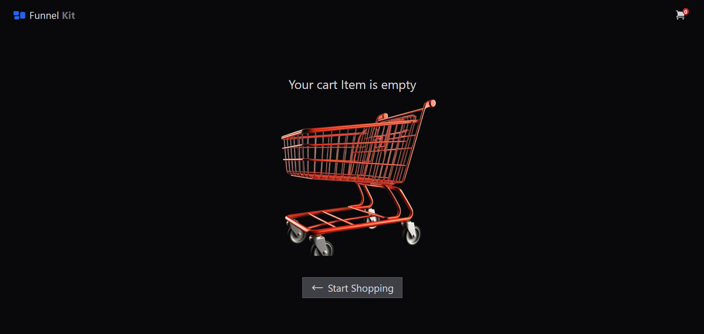

# FunnelKit Web Assignment

### Starting local development

- Make sure you have Node version 18 or above.

###### Step 1

```
git clone git@github.com:itslakshyayadav/funnelKit-web-assignment.git
```

###### Step 2

```
npm install
```

###### Step 3

```
npm run dev
```

The server would start at http://localhost:5173/
Go to broswer and enter this URL.

# Project Preview

---

### Dashboard


</br>

### Product Details


</br>

### Cart Dashboard


</br>

### Empty Cart


